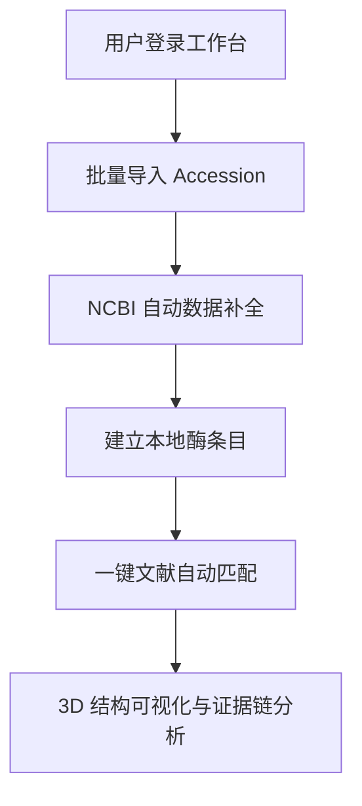

## 1. 产品概述
FreeWillase 是一个面向酶学研究的高端管理平台，致力于通过优雅的界面和自动化的流程（NCBI 导入、文献关联、3D 结构展示）提升研究效率。
- 解决酶条目分散、结构功能数据不一致的问题，提供一站式、极简主义的科研管理体验。
- 核心价值：通过 Apple 风格的优雅交互，将复杂的生物信息处理流程（NCBI 建库、文献匹配）转化为直观、高效的可视化体验。

## 2. 核心功能

### 2.1 用户角色
| 角色 | 注册方式 | 核心权限 |
|------|----------|----------|
| 研究人员 | 邮箱/工号注册 | 核心业务流程（导入、查询、文献匹配、结构查看） |
| 访客 | 无 | 仅限公开数据浏览 |

### 2.2 功能模块
1. **智能工作台 (Dashboard)**：全景概览、任务动态、核心指标可视化。
2. **酶条目中心 (Enzyme Library)**：网格/列表视图切换，深度详情页。
3. **NCBI 自动建库 (NCBI Importer)**：批量 Accession 导入，任务实时追踪。
4. **文献关联引擎 (Literature Matcher)**：自动匹配文献元数据，关系图谱。
5. **3D 结构工作站 (Structure Viewer)**：Mol* 深度集成，高质量三维渲染。
6. **预测接口中心 (Prediction Hub)**：MiniFold/ESM 接口预留与配置。

### 2.3 页面详情
| 页面名称 | 模块名称 | 功能描述 |
|-----------|-----------|-----------|
| 工作台 | 概览卡片 | 实时显示任务进度、数据库规模、最新匹配文献 |
| 酶库列表 | 高级筛选器 | 极简侧边栏筛选，支持模糊搜索与多重过滤 |
| 酶详情页 | 多维视图 | 整合序列、结构、功能、文献的卡片式布局 |
| 导入中心 | 任务追踪 | 类似 Apple 软件更新的进度条与详细日志流 |
| 结构查看器 | 沉浸式 3D | 全屏 3D 展示，支持位点高亮与文献联动 |

## 3. 核心流程
研究人员输入 Accession -> 系统异步拉取 NCBI 数据 -> 自动补全本地库 -> 一键触发文献匹配 -> 在 3D 视图中查看结构与功能证据。

## 4. 用户界面设计
### 4.1 设计风格
- **视觉语言**：Apple 风格，强调负空间、柔和阴影、高对比度文字。
- **色彩方案**：纯白/极简灰背景，辅以深蓝 (#007AFF) 或翡翠绿 (#34C759) 作为强调色。
- **排版**：优先使用系统默认字体 (SF Pro / PingFang SC)，大标题与正文对比明显。
- **交互效果**：磨砂玻璃 (Backdrop Blur)、弹性缩放、细腻的过渡动画。
- **图标**：使用 Lucide Vue Next 的线性细体风格。

### 4.2 页面设计概览
| 页面名称 | 模块名称 | UI 元素 |
|-----------|-----------|-----------|
| 全局导航 | 侧边栏 | 半透明模糊背景，极简线性图标，选中态微光效果 |
| 酶详情页 | 信息卡片 | 圆角 16px，柔和阴影 (Shadow-xl)，卡片间距 24px |
| 3D 视图 | 控制面板 | 悬浮浮窗设计，支持折叠，保持画面洁净 |

### 4.3 响应式
- **宽屏适配**：针对 1440px+ 优化，采用多栏布局，防止内容在大屏幕上过度拉伸。
- **比例平衡**：使用容器最大宽度限制 (Max-w-7xl)，保持视觉中心。
- **移动端**：自适应收缩侧边栏，保留核心查询功能。

### 4.4 3D 场景指引
- **环境**：浅色模式，柔和的全局环境光。
- **交互**：点击 3D 模型位点，自动弹出关联文献浮窗。
- **性能**：优化 Mol* 加载策略，确保大分子结构流畅。
