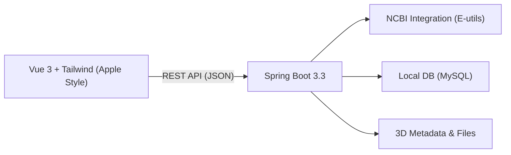

## 1. 架构设计
FreeWillase 采用极简前后端分离架构，前端使用 Vue3 驱动的高端交互界面，后端基于 Spring Boot 提供标准化 RESTful 接口。



## 2. 技术栈说明
- **前端**:
    - 框架: `Vue 3.4` (Script Setup)
    - 构建: `Vite`
    - 样式: `Tailwind CSS 3.4` (含 `backdrop-blur` 与 `shadow-apple` 扩展)
    - 图标: `Lucide Vue Next`
    - 组件库: 基于 Tailwind 的自定义组件 (仿 Shadcn/Vue 风格)
    - 状态管理: `Pinia`
    - 3D 可视化: `Mol*` (WebAssembly 驱动)
- **后端**:
    - 核心: `Spring Boot 3.3` (Java 17)
    - 持久层: `MyBatis-Plus`
    - 认证: `Spring Security + JWT`
    - 数据源: `MySQL 8.0`

## 3. 路由定义
| 路由 | 用途 | 页面模块 |
|------|------|----------|
| `/` | 登录/门户 | Login / Hero |
| `/dashboard` | 概览 | Dashboard |
| `/library` | 酶库 | Enzyme Library |
| `/library/:id` | 详情 | Enzyme Detail |
| `/importer` | NCBI 导入 | NCBI Importer |
| `/matcher` | 文献匹配 | Literature Matcher |
| `/viewer/:id` | 3D 视角 | Structure Viewer |

## 4. 关键 API 定义
### 4.1 数据传输对象 (DTO)
```ts
// 极简化的 DTO 定义，去除调试字段
export interface Enzyme {
  id: string;
  accession: string;
  name: string;
  organism: string;
  status: 'active' | 'pending' | 'failed';
  updatedAt: string;
}

export interface Task {
  id: string;
  type: 'NCBI_IMPORT' | 'LIT_MATCH';
  progress: number;
  status: 'running' | 'completed' | 'error';
  message?: string;
}
```

### 4.2 核心接口
- `GET /api/enzymes`: 分页获取酶列表，支持多参数过滤。
- `POST /api/enzymes/import`: 提交 Accession 列表。
- `GET /api/tasks`: 获取当前运行中的异步任务。
- `POST /api/enzymes/{id}/match`: 触发文献匹配。

## 5. 数据模型设计
采用 `MyBatis-Plus` 映射核心业务表：
- `enzyme_entry`: 存储酶的核心元数据（Accession, Name, Organism 等）。
- `literature_record`: 存储文献元数据（Title, DOI, Abstract 等）。
- `import_task`: 追踪 NCBI 导入进度。

## 6. 响应式与交互规范
- **Grid 布局**: 使用 `grid-cols-1 md:grid-cols-2 lg:grid-cols-3` 实现灵活适配。
- **Max Width**: 全局内容包裹在 `max-w-[1440px] mx-auto` 中。
- **Apple Blur**: 导航栏使用 `bg-white/70 backdrop-blur-md sticky top-0`。
- **Transitions**: 所有的状态切换必须有 `transition-all duration-300` 效果。
